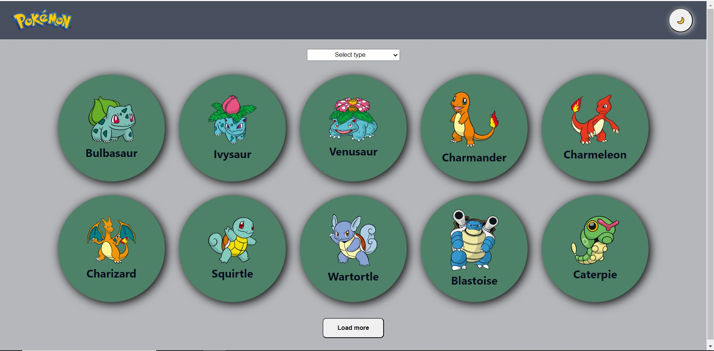
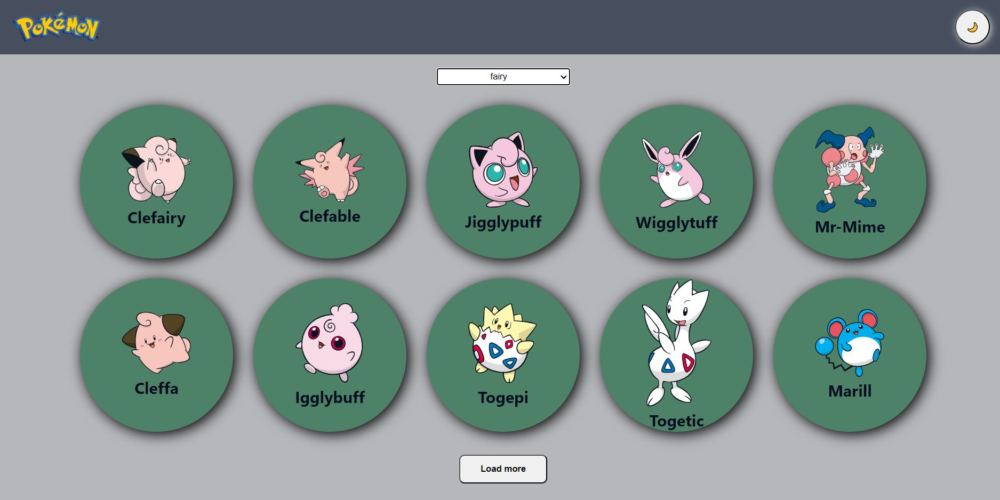
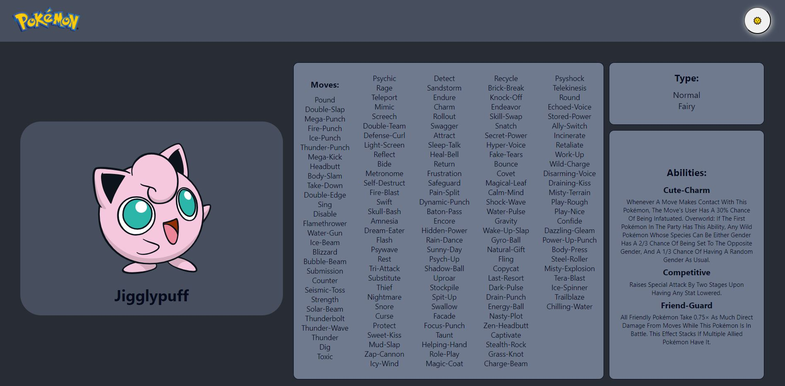

# Technical test - Pokemon API Project

This project was bootstrapped with [Create React App](https://github.com/facebook/create-react-app).

## Table of contents

- [Overview](#overview)
  - [The challenge](#the-challenge)
  - [Screenshot](#screenshot)
  - [Links](#links)
- [My process](#my-process)
  - [Built with](#built-with)
  - [What I learned](#what-i-learned-and-difficulties)
  - [Continue developing](#continue-developing)
  - [Run Project in your computer](#how-you-can-run-the-project-in-your-computer)
- [Author](#author)

## Overview
 

### The challenge

The purpose of this app is to show a list of Pokémons on the Home Page, showing only ten pokémons a time, and loading ten more on the click of the button Load More. Each pokemon component is clickable and should direct to an internal page with the pokemon details, such as the name and image, the list of moves, list of abilities with their description and the type of the Pokemon.

This app obtains data from the public API PokeAPI.

- The user should be able to see a hover style on the clickable items, such as the Load More button on the Home Page, also the button to change the theme of the page, and on each one of the Pokémons shown;
- When clicking on the sun or moon, the user should be able to see the change of theme from light to dark or the other way around;
- There is a select input where the user can choose a specific type of Pokémon to filter. When doing that, it should load only the Pokémons of that type, also showing ten items at a time. When clicking to load more, it should bring another ten Pokémons of that type;
- As it was just said, when clicking on each pokemon, it should direct to another page with their details;
- Inside the internal page, the user should see a link to “Go back to home page”, when clicked it will return to the Home Page. Besides that, if the user clicks on the Pokemon logo located on the header menu, it should also direct to the Home Page;

### Screenshot
#### Home Page

#### Home Page - with a selected type

#### Internal Page (Pokémon details) on dark mode

### Links

- Solution URL: [Solution URL - Repository](https://github.com/julialimp/pokemon-project)

## My process

### Built with
- React.js: used to build the user interface and create components, avoiding repeating too much code and keeping the code cleaner;
- It was used a Single Page Application (SPA) for this project, this way it doesn’t have to refresh the page, leading to a faster response;
- Context API was used to create the style of the light and dark theme. This way it was easier to pass the style properties to each one of the components that should change on the click;
- I used styled-components library instead of CSS to be able to do it in a dynamic way, being able to write jsx code inside the styling properties;
- React-router-dom was used to direct the links of the SPA, switching from the home page to the internal page and vice-versa.
 
 

### What I learned and difficulties

There were several times I stuck on a different part of the project, but then I took some time to think, write down some ideas outside the screen and that way it really helped to clear my mind and think more clearly on possible solutions to test.

I feel I improved a lot from past projects, this one being the most complex so far, but I could put in practise a lot of methods together. Manipulating the data from the API was something that I could do using the console.log() to see where to go.

The difficulty I had was when I had to fetch the API endpoint for the Home Page (the general list of Pokémons) and another fetch for the specific Pokémon details. I wasn't how to combine both, but then I realized I had to separate them on two different services to get the list and two different components.

The thing I most had difficulty with was the filter of Pokémons by type. At first I had to get a list of all possible types. For that I had to fetch another endpoint which would return the list I needed. Then I had to find a way to link the selected type so that it would render only Pokémons of that specific type. It took me a really long time to solve that one without repeating a lot of code.

I used the `.filter()` method to get the specific Pokémon type according to the value brought by the selected type on the input, but in this case it was filtering only the rendered Pokémons (the 10 pokémons of the Home page). For that I had to use a conditional to render the normal list if no type was selected, but if it was I took off the limit of 10 and instead I used the `.slice()` to remain showing only 10. The Load More button had to have two functionalities too because of that.

At the end, I could make everything work and I was happy with the results and the progress I had doing this.

### Continue developing

There are probably better and easier ways of making the project work the way I wanted, and I will continue studying and researching about possibilities to keep improving my abilities and my problem solving skill, and will try my best to always keep the code as clean as possible.

## How you can run the project in your computer

1. Make sure you have Node.js installed in your computer;
2. [Download the project](https://github.com/TalitaSalless/Pokemon) using `git clone`.
3. Open the terminal and go to directory `cd pokemon-project`;
4. Execute `npm install` to install all dependencies;
5. `npm start` runs the app in the development mode;
6. Open [http://localhost:3000](http://localhost:3000) to view it in your browser.

*Make sure PokeAPI is accessible so that the application can obtain the data properly.*

## Author

- Linkedin - [Juia Limp](https://www.linkedin.com/in/julia-limp/)
- Instagram - [@julialimp](https://www.instagram.com/julialimp)
- GitHub - [@julialimp](https://github.com/julialimp)